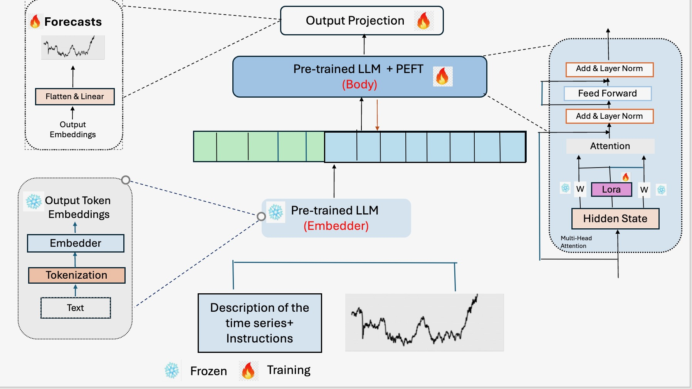
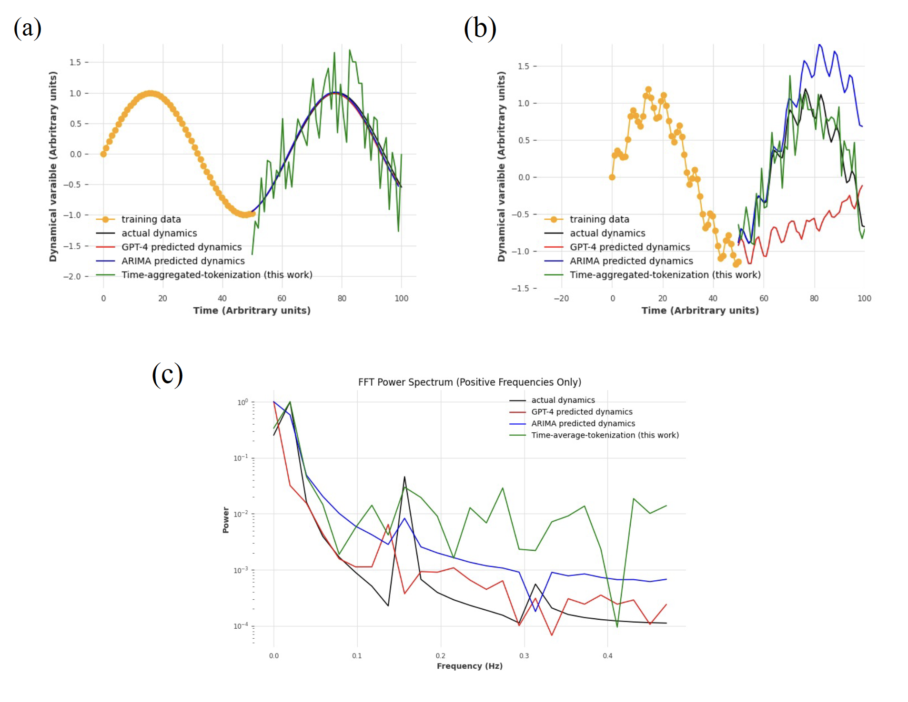
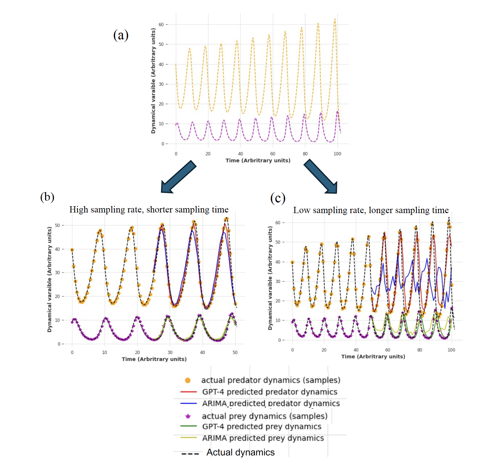

# LLM-based time series modeling of complex nonlinear dynamics

This repository is an extension of the paper:
[_Large Language Models Are Zero Shot Time Series Forecasters_](https://arxiv.org/abs/2310.07820)
by Nate Gruver, Marc Finzi, Shikai Qiu and Andrew Gordon Wilson (NeurIPS 2023).


<figure>
  
  <figcaption> Schematic of our time series forecasting pipeline. This consists of three stages -- (a) Training of output projections with the generated samples at time points from dynamical systems (b) Training of the adapter of the LLM for fine-tuning (c) Using the trained model for probabilistic time series forecasting. </figcaption>
</figure>


## Contributors:
* Raunak Dey
* Chandramani Lu
* Ravi Chepuri
* You (contributions welcome)! Please shoot me an email at [Raunak Dey](mailto:rdey@umd.edu?subject=[GitHub]%20Source%20Han%20Sans)


## 🛠 Installation
Run the following command to install all dependencies in a conda environment named `llmtime`. Change the cuda version for torch if you don't have cuda 11.8. 
```
source install.sh
```
After installation, activate the environment with
```
conda activate llmtime
```
If you prefer not using conda, you can also install the dependencies listed in `install.sh` manually. 

Add your openai api key to `~/.bashrc` with
```
echo "export OPENAI_API_KEY=<your key>" >> ~/.bashrc
```

Finally, if you have a diffferent OpenAI API base, change it in your `~/.bashrc` with
```
echo "export OPENAI_API_BASE=<your base url>" >> ~/.bashrc
```


## 💡 Tips 
Here are some tips for using LLMTime:
- Performance is not too sensitive to the data scaling hyperparameters `alpha, beta, basic`. A good default is `alpha=0.95, beta=0.3, basic=False`. For data exhibiting symmetry around 0 (e.g. a sine wave), we recommend setting `basic=True` to avoid shifting the data.
- The recently released `gpt-3.5-turbo-instruct` seems to require a lower temperature (e.g. 0.3) than other models, and tends to not outperform `text-davinci-003` from our limited experiments.
- Tuning hyperparameters based on validation likelihoods, as done by `get_autotuned_predictions_data`, will often yield better test likelihoods, but won't necessarily yield better samples. 


## Usage and key results:

### On oscillatory dynamics: tattoo method outperforms zero shot

<figure>
  
  <figcaption> LLM-based forecast of a univariate dynamical system: (a) the simple harmonic oscillator. (b) Three coupled normal models of an oscillatory dynamical system. (c) Power spectral density of the forecasted values compared to the actual one, GPT-4 fails to recapitulate the lower frequency components, which ARIMA can
    Black: true system, Red: LLM forecast, Blue: Arima forecast, Green: Time aggregated tokenization (based on fine-tuning LLama models) </figcaption>
</figure>


### Lokta-Volterra: characteristic timescale matters! -- we can aggregate tokens, when a higher sampling rate is not necessary

<figure>
  
  <figcaption> Comparing Sampling rates (a) The continuous version of the dynamical system simulated from (b) High sampling rate forecasting (c) Low sampling rate forecasting.  </figcaption>
</figure>

### Summary of key results:
* Time series tokenized with LLM can be used for probabilistic forecasting
* For an oscillatory dynamical system GPT-4 can miss the low-frequency component (which was less dominant in our experiment) and focus on the more dominant high-frequency component. With fine-tuned LLama, we can capture the low-frequency component while ignoring the high-frequency one, as it involves aggregation in the smaller segments. 
* Due to the aggregation of textual information, our method requires less computing power and can be more effectively fine-tuned.
* GPT-4 is better in capturing long-term memory in the time series, with the caveat that it will need a large context window for time series with longer memory. In that case, our method can be more effective in capturing these long-term dependencies.
* When individual components of the multivariate time series are modelled independently, GPT-4 is better than standard statistical techniques, as they ignore the cross-correlation effects.
* We think it is more effective to sample with a higher sampling rate for less time (number of training points being constant), given the governing dynamics remain unchanged. A sampling rate less than the characteristic timescale of the dynamical process will lead to erroneous forecasting.